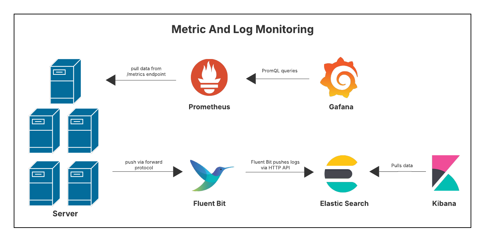
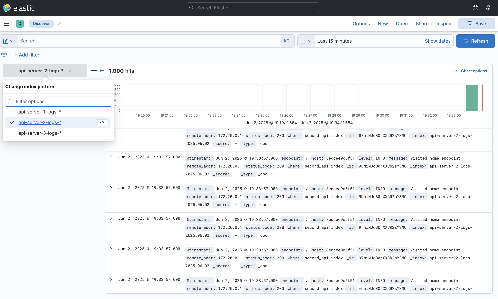
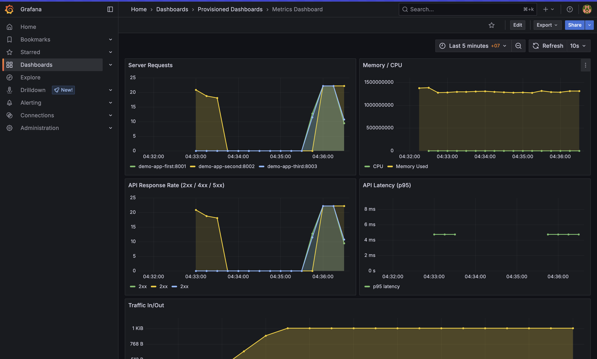

# Metric-And-Log-Monitoring

A real-time observability stack for structured logs and metri across **multiple API services** using Fluent Bit, Elasticsearch, Kibana, Prometheus, and Grafana.

---

## 🧭 Overview Diagram

<p align="center">
  
</p>

---

## 🔧 Components

### 🔹 **1. Server (Source of Logs and Metrics)**

* Each server exposes:

  * A `/metrics` endpoint (e.g., via Prometheus client in Flask, Node Exporter, etc.)
  * Structured logs, which are forwarded via the **Fluent Bit forward protocol**

---

### 🔸 **2. Metric Monitoring Pipeline**

#### 🟠 **Prometheus**

* **Pulls metrics** from each server's `/metrics` endpoint on a scheduled interval
* Stores time-series data in an internal TSDB (Time Series Database)

#### 🟠 **Grafana**

* **Pulls data** from Prometheus via **PromQL queries**
* Displays custom dashboards for:

  * HTTP request count and rates
  * Response time (p95, p99)
  * CPU, memory, and disk usage
  * Alert thresholds (visual + AlertManager integration)

---

### 🔸 **3. Log Monitoring Pipeline**

#### 🔵 **Fluent Bit**

* Listens on multiple TCP ports (e.g., `24224`, `24225`, `24226`)
* **Pulls data** from each port via the **forward protocol**
* Filters, parses, and structures logs from each server/service
* **Pushes logs** to **Elasticsearch** using the HTTP API

#### 🔵 **Elasticsearch**

* Stores logs in **daily rotated indices**, such as:

  * `api-server-1-logs-*`
  * `api-server-2-logs-*`
  * `api-server-3-logs-*`
* Supports full-text search and log aggregation

#### 🔵 **Kibana**

* **Pulls data** from Elasticsearch via dynamic queries
* Visualizes logs with:

  * Time-based filters
  * Custom dashboards
  * Searchable fields per service

---

## 📦 Folder Structure

```
├── demo_app/                 # Flask apps with Prometheus + Fluent logging
├── elastic_search/          # Elasticsearch configs and index template
├── grafana/                 # Dashboards and datasources
├── kibana/                  # Index pattern loaders
├── log_collections/         # Fluent Bit configs and parsers
├── metrics/                 # Prometheus rules and alertmanager.yml
├── docker-compose.yaml      # Stack orchestration
├── init_elastic_search.sh   # Auto apply ES template
├── init_kibana.sh           # Auto create Kibana index patterns
└── README.md
```

---

## ✅ Getting Started

### clone my repository

```bash
git clone https://github.com/guncv/Metric-And-Log-Monitoring.git
```

### removes & rebuilds entire monitoring stack

```
make rebuild 
```

### You’ll get:

<p align="center">
  
</p>

<p align="center"><strong>📊 Live Structured Logs per App in Kibana</strong></p>

<p align="center">
  
</p>

<p align="center"><strong>📈 Multi-App Metrics Dashboard in Grafana</strong></p>

---

## 📬 Contributions

* Add more app services
* Extend metric rules (e.g., DB latency, queue depth)
* Improve filtering and template mapping in Fluent Bit
